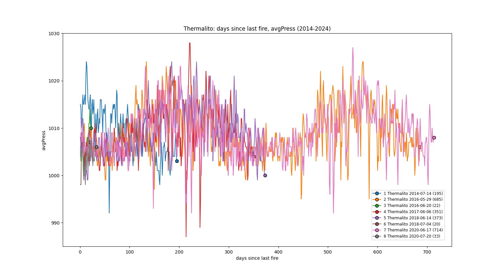
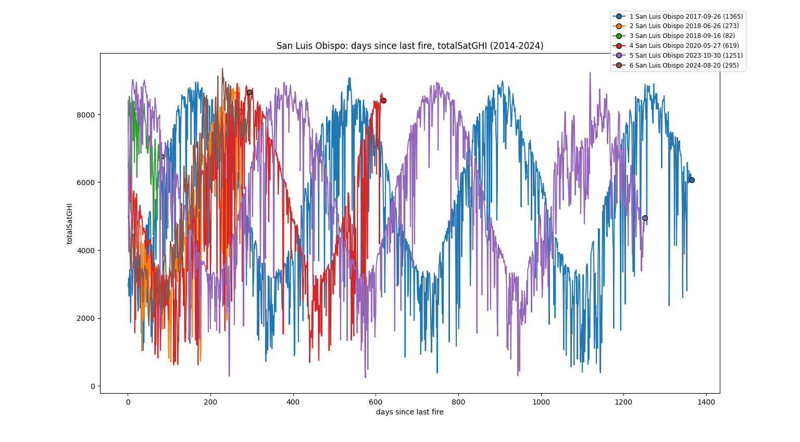
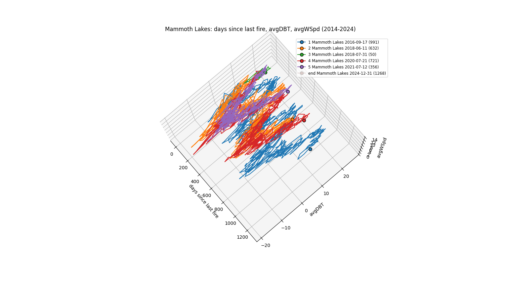
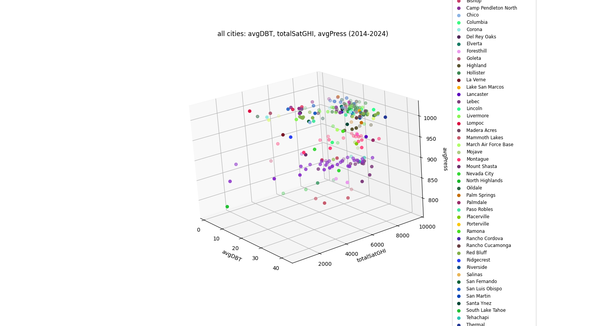
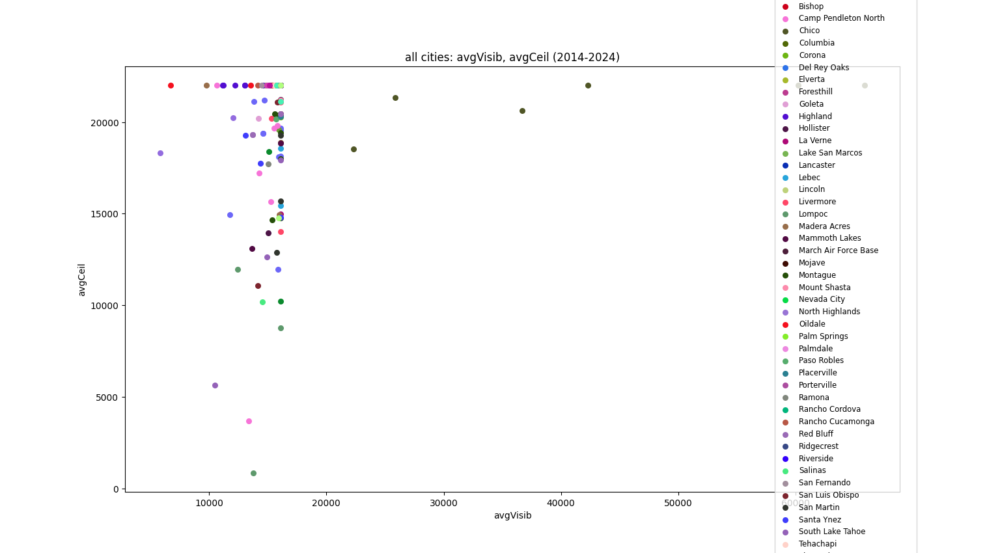

# California Wildfire Prediction
*Analyzing previous weather data to predict future fires*

### Presentation

A 10 minute presentation and explanation can be found [here](https://youtu.be/QRuKtb8MCZk).

### Visualizations

Since weather data is naturally multidimensional, visualizing portions of the data requires reducing it to 2 or 3 dimensions. To do this I wrote scripts that allowed me to track up to 3 attributes of a city's weather data across the entire dataset, as well as plot the attributes for all cities dataset (but at the cost of historical context between fires).

I noticed that certain weather attributes, such as average pressure (avgPress) and total global horizontal irradiance (totalSatGHI) follow a sine-like curve. Both of these seem to have similar cycle lengths of approximately 350 days, with peaks lasting roughly 50-75 days. Average dry-bulb temperature (avgDBT) also seemed to have this pattern, although with slightly shorter cycles.

Some other patterns I noticed is that days with fire outbreaks tend to have high average visibility (avgVisib) and average ceiling (avgCeil). They also seem to cluster towards average pressure (avgPress) values of around 850 and 1000.

### Data Processing

*Cleaning*

The weather data for all cities from 2014 to 2024 was gathered from the [CALMAC California Weather Files](https://www.calmac.org/weather.asp), while the fire data was gathered through the [CAL FIRE Incident Data](https://www.fire.ca.gov/incidents). These two datasets were filtered, processed, and combined so that the resulting set only contained cities that had at least 1 fire outbreak within the 2014 to 2024 time period, as well as per-city daily averages for all available weather features. For additional details regarding these attributes, the files that were used in this process, or a higher-level description of this project, refer to the [previous README](https://github.com/ExoticBubble15/CA-Wildfire-Prediction/blob/8656dcc1055cbcf2e245c252f4dec8043b4fc489/README.md).

*Feature Engineering*

Seeing that fire outbreaks are not a standard event, I tried to view their occurrences as outliers/deviations from what are considered normal weather conditions. Therefore when it came to adding features, I wanted to emphasize how different each feature was from its city-wide mean throughout the training set. This was done by the formula `(daily_feature_value - city_feature_mean)^2`, with the result being multiplied by `-1` if the daily value was below the city mean. This was only applied to features that were daily averages, with features that were daily totals (SatGHI, SatDNI, and rain) modified to be rolling sums since the previous fire in the same city. These, alongside a counter of how many days passed since the previous city fire, resulted in a total of 25 weather-related attributes per city, per day.

### Modeling

A modified Nearest Neighbors approach is taken to rank cities by the highest risk of fire outbreak on any given day. This includes consulting 3 neighborhood models, each a subset of the training data, for each city:

1. **nnFires** - The full collection of 170 fire outbreaks, with corresponding attributes for the city each fire broke out in.
1. **nnSameCity** - The full collection of daily weather attributes for that city only, including any fire outbreaks.
1. **nnOtherCity** - The full collection of daily weather attributes for all other cities, including any fire outbreaks.

With 58 different cities, this results in a total of `(2*58)+1=117` distinct models. For each day, the following process was repeated for each city (called *input*):

1. For each model, find the set number of most-similar days from the training data. These amounts are the variables `fireNumNeighbors = 20`, `sameCityNumNeighbors = 100`, and `otherCityNumNeighbors = 7000`.

1. For each of the corresponding days and models, calculate the group's total 'score' by taking into account the day's cosine similarity to *input*, whether a fire occurred on that day in that city, and a decay weight `(formula on line 50 of knn.py)`.

1. Take each model's score and multiply it by a corresponding weight, of which are the variables `fireWeight = .6`, `sameCityWeight = .15`, and `otherCityWeight = .25`. Add these weighted scores together to get *input*'s total score.

Repeating this process for all 58 cities and sorting by highest total score first yields the city ranking for the day.

The amount of neighbors, decay formula, and model weights were all chosen relatively arbitrarily by trial-and-error, and were the best combination of variables that led to a relatively decent spread among city and day rows. Given that the model takes upwards of an hour per calendar year to run using all 58 cities, I tweaked these values through sampling the validation set by either randomly selecting a set number of rows or using a consistent 1 year stretch for a single city.

The number of neighbors for each model was chosen to (hopefully) get a sizable chunk of each portion of related data, taking into account each of their sizes within the training set (|fires| = 178, |sameCity| ≈ 2500, |otherCity| ≈ 146000). The decay weight uses an exponential decay formula based on how many days are between the given day and *input*, using a constant that is multiple times the length of a certain feature's cycle (see graphs for reference). The purpose of this is to more heavily weigh days that are closer to *input*, while also giving ample 'space' to rows most similar to the validation and testing data since all models only include the training data. Since fire outbreaks are very rare, the model weights aimed to give similar fires more importance while ensuring the total score across all 3 models does not exceed 1.

### Results

*Evaluation Metrics*

It's important to note that the output for each day is not necessarily the city that has the highest probability of a fire breaking out, but rather a ranking of all cities ordered from most to least likely to experience an ignition. The key difference is that the way the 'likelihood' of each city's chance to experience a fire is calculated rather arbitrarily, and is meant to be used in comparison with other cities rather than the literal probability of a fire occurring in a city. Given that fire outbreaks are extremely rare in this dataset (238 across 233,032 days = 0.1%), I measured model accuracy by focusing on the city rankings of days where fire outbreaks were confirmed to occur.

For a set of given results, `analyze_results.py` has 2 separate outputs based on the predicted position of the cities on days where fires occurred. All scores are out of how many fires were confirmed to break out across the validation/testing time period.

1. **Points-based Scoring** - For cities that experienced fires, award a fraction of points based on how close the city was to the front of the prediction ranking. Award 1 point (58/58) if the city is the highest ranked, 57/58 of a point if the city is the second-highest ranked, and continue this pattern until the last position in the ranking gets 1/58 points.
- Using this scoring system, randomly ranking the cities for each fire outbreak would achieve about 0.5 points per city. Only 1 fire occurs per day in most cases, so given `x` total fires, random ranking would yield `x/2` points. *This is not exactly true as 2 different fires occurring on the same day yields a maximum of `1+(57/58)` points, however this rarely occurs so the code handles every fire as 1 maximum point for simplicity.*

2. **Percentile-based Scoring** - Continuously divide the predicted city rankings into percentiles, and check whether cities where fires actually occurred lie in that top percentile. Only count fire-affected cities, and disregard/don't-penalize for unaffected ones.
- For this scoring system, randomly ranking cities would correctly position in proportion to the percentile amount. For example, the top 25% of a random ranking can expect to contain 25% of the confirmed fires. More details are produced in the log.

Details for both evaluation methods for the validation and testing sets can be found in `validationResults.txt` and `testingResults.txt` respectively. Note that these do not contain queries and dictionaries I used to generate the appropriate data and store my equivalent "testing labels" and "predictions". These are labeled and located in `results.py`, which was ran to generate the previously mentioned *.txt* files.

*Analysis*

Using these methods to evaluate my models, my validation set showed that my nearest neighbors approach outperformed random sampling in regards to points-based scoring, as well as with all top percentiles 25% and below. However, the random sampling did outperform my attempts when it came to the top 10th and 20th percentiles, although by relatively narrow margins.

However, these results did not match those from comparing my testing set to the random sampling approach. The only metric I was able to beat the random sampling in was the top 33rd percentile, and even that was by a slim margin. My results were quite comparable with points-based scoring metric and top 50th percentile, yet still lower than the expected random sample.

Despite this seemingly odd inverse between the validation and testing sets, I believe that the issue stems from the constant used in the exponential decay function. This is because initially, I had it set to 350*2 as a way to 'cover the 2 most recent weather cycles', and heavily weigh against anything beyond. However, the testing data begins in 2023, meaning that the 2 previous weather cycles can stretch to a maximum of 2021, which is before the training data begins. Therefore, all similar rows to any of the testing data were not as heavily weighed as they should be, resulting in suboptimal performance. This did not affect the validation set as much because it could stretch back to 2019 or 2020 before the '2 cycle penalty' occurs, both of which are still within the training data.

To test this hypothesis, I reran both sets using `const = 350*6` via `python knn.py validation validationResults2` and `python knn.py testing testingResults2`. The test set results did indeed improve, although only marginally from the original model and still was beat by random sampling in all the same aspects. I think the validation results got slightly worse overall, with the new results increasing in points-based scoring and top 50th percentile but at the cost of a worse 10% and 33.3%.

### Replicating Results

To run a demo of the data visualization, feature engineering, and model creation/evaluation, simply run `python make.py` in the root directory. If you would like to replicate the exact results in `testingResults.txt`, run `knn.py testing <file_output_name>` in the same place. Given the slow nature of Nearest Neighbors and the query-heavy/resource-intense method I used to implement my models, it will likely take upwards of 2 hours to fully complete.

### Additional Info

*General*
- The original weather and fire files that were used to generate the complete dataset can be found [here](https://drive.google.com/drive/folders/1D4q_7aPc9mx8MtHmdEg1-FQKdTX9w-JH) (they are not included in the repo because they are simply too big).
- The files in the `file` folder were processed by `process-fire-data.py` and produced `complete-data/complete-fire-data.csv`.
- Likewise, the files in the `weather` folder were processed by `process-weather-data.py` and produced `complete-data/complete-weather-data.csv`
- A series of SQL queries documented in `sql-queries.txt` were applied on various sets of data to ultimately produce the *.csv* files in the `cleaned-weather` folder.
- These queries were manually applied and results shifted around by hand, and thus are not part of the demo.
- Folder names changed over the course of the project, but everything generally stayed the same. Previous queries were not always updated to 100% accurately reflect their new counterparts, but any discrepancies should be minimal and straightforward.

*Personal Thoughts and Feelings*
- I had a lot of fun with this project, even though there are areas I wish I could have improved and added more (namely predicting fire intensity/acres_burned and duration, had I figured out how to actually predict outbreaks).
- There is likely an alternative approach that is more optimal for this project, however I think my approach was interesting and fun to pursue even if it didn't achieve the best results.
- It did not turn out the way I thought it would've at the beginning, but it was a pleasant suprise.
- I admittedly put off progress for long periods of time which could have been used to make the end product better, but oh well.